# Buffet Clearers Overengineered


The struggle is real. So is the data.
For interactive website, check out:
https://buffet.popped.dev

**This repo:**  
- Reads Telegram group food raid data  
- Overanalyzes it with Python, pandas, and unnecessarily pretty graphs  
- Tries to predict when and where food will appear, for science (and snacks)  
- Renders a gallery of charts about snacks, ice cream, and desperate students  
- Useful for data nerds and hungry undergrads


## Requirements

- Python 3.10+ recommended  
- Dependencies are listed in `requirements.txt` (pandas, numpy, matplotlib, boto3, scikit-learn).

## Data

The loader picks a chat export in this order:

1. `BUFFET_CHAT_EXPORT` — path to a JSON export file, if set  
2. `data/chat_export.json` — if present  
3. `data/result.json` — if present  
4. `data/chat_export.sample.json` — bundled sample  
5. Otherwise it tries S3 via a local metadata API (see `src/load_inspect.py`).

For a normal local run, place your export as `data/result.json` or `data/chat_export.json`, or set `BUFFET_CHAT_EXPORT`.

## How to run

From the project root:

```bash
python -m pip install -r requirements.txt
python run_graphs.py
```

Or use the wrappers (install deps + run the pipeline):

- **Windows:** `render_graphs.cmd`
- **macOS / Linux:** `chmod +x render_graphs.sh && ./render_graphs.sh`

On Windows, if you see encoding issues in the console, the scripts set `PYTHONIOENCODING=utf-8`; `run_graphs.py` also reconfigures stdout/stderr to UTF-8 when possible.

Outputs are written under `out/`, grouped by category. A manifest of generated PNGs is saved as `out/manifest.json`.

## Output gallery

### Food patterns


### Weekly alerts


### Prediction model


### Clustering

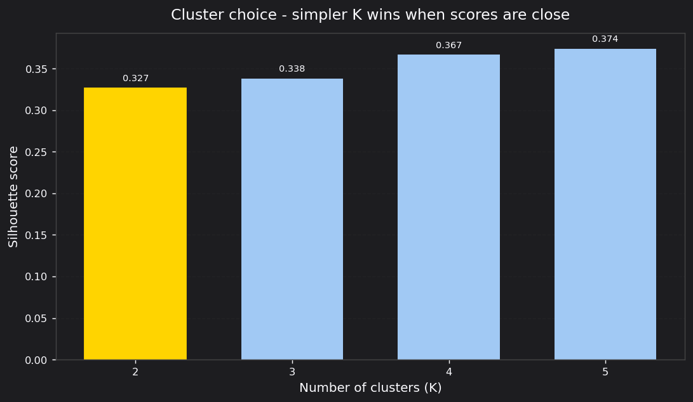

K=2 was chosen even though scores keep rising up to K=5 (0.327 → 0.374). The gains beyond K=2 are small enough that the extra clusters would just be hairline splits of the same evening window — not genuinely new patterns. Two clusters is the simplest answer that still draws a real distinction.

---

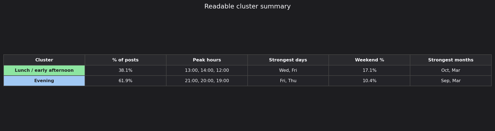

The data splits cleanly into a **Lunch / early afternoon** cluster (38% of posts, peaks 12–14h, strongest on Wed and Fri) and a larger **Evening** cluster (62% of posts, peaks 19–21h, strongest on Thu and Fri). Evening food is actually the norm — lunch leftovers are the exception.

---

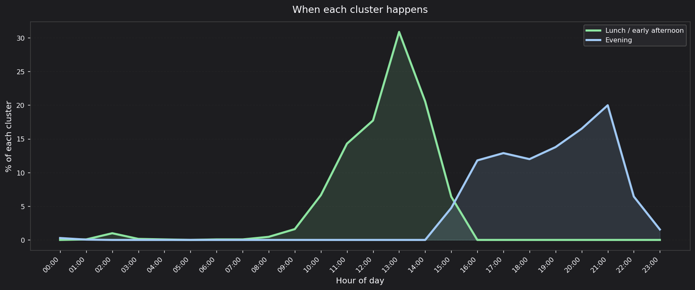

The lunch cluster is a sharp spike: it rises steeply from 10h, hits ~31% of its posts at 13h, then falls to near-zero by 15h. The evening cluster is a broad plateau — it builds from 16h, sustains ~12% per hour through 17–18h, then crests around 21h. These are two very different behavioural shapes, not just "early vs late".

---

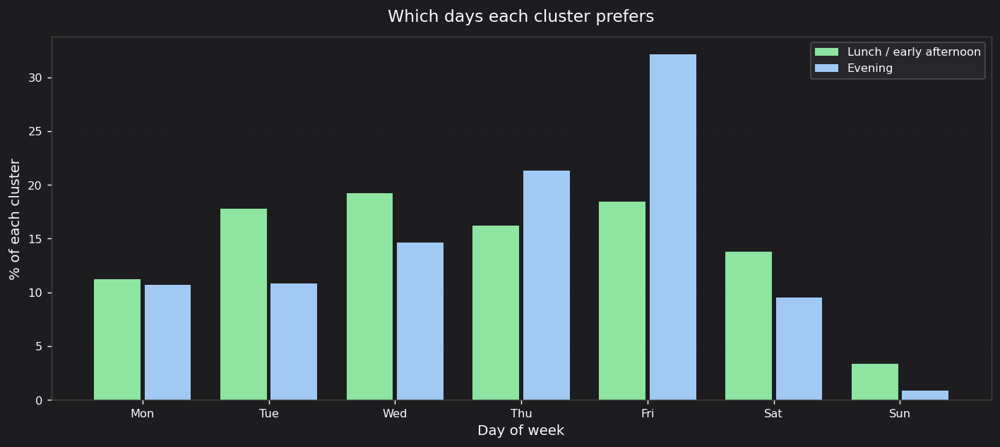

Both clusters are essentially weekday phenomena. The lunch cluster is spread fairly evenly Mon–Fri with a slight Wed/Fri lean. The evening cluster has a pronounced Friday spike (~32%) and a secondary Thursday bump (~21%) — Friday night events and end-of-week gatherings dominate evening food. Sunday is nearly dead for both.

---

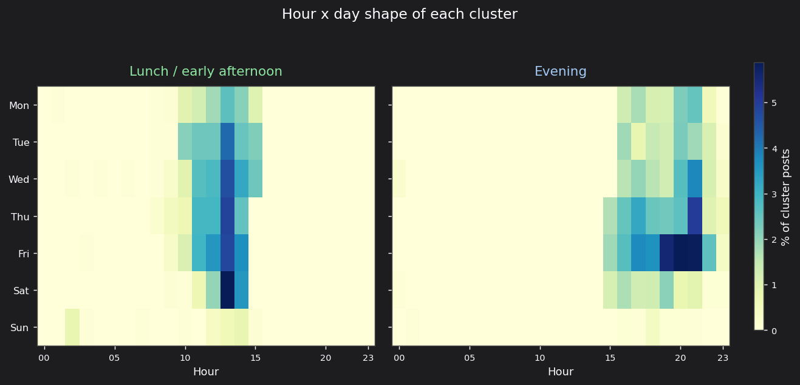

The side-by-side heatmaps make the two clusters unambiguous. Lunch activity is a tight vertical band from 10–14h running across all weekdays with even coverage. Evening activity is a broader band from 16–22h, densest on Thursday and Friday nights — Friday at 20–21h is the darkest cell in that panel.

---

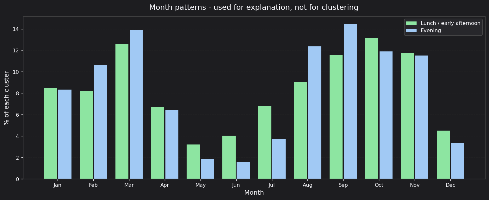

Both clusters track the academic calendar: troughs in May–June (exams, then holidays) and December, peaks at semester starts in August and February–March. The evening cluster spikes harder in September (~14%) than the lunch cluster does, suggesting early-semester orientation and welcome events tend to run into the evening. Both clusters are nearly identical in monthly shape, confirming that month is not what separates them — time of day is.

---

### Location analysis

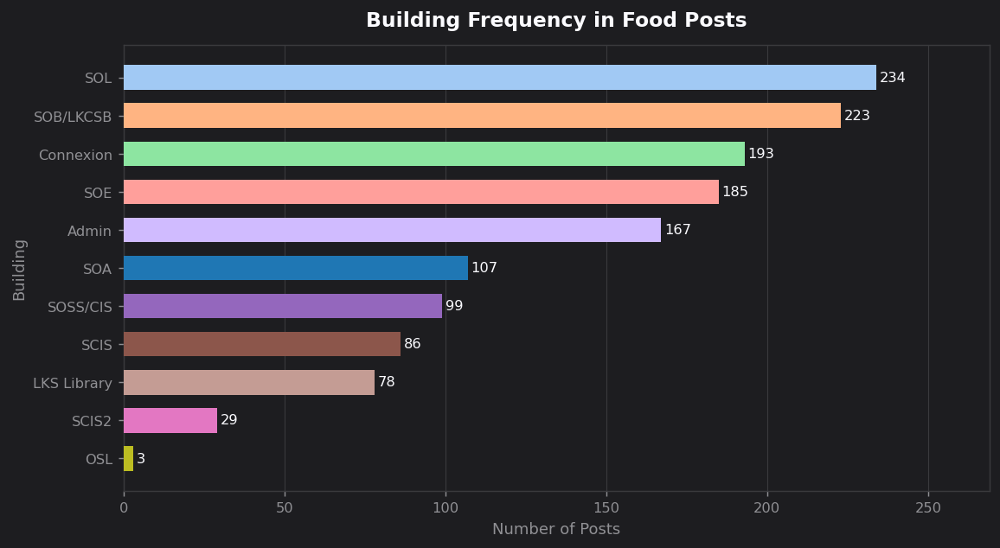

SOL (234) and SOB/LKCSB (223) generate the most food alerts by a clear margin — these two buildings host the highest density of catered events on campus. Connexion (193), SOE (185) and Admin (167) form a second tier. SCIS2 is low (29) because students posting from that building typically write "SOE" instead, since the two schools share the physical building.

---

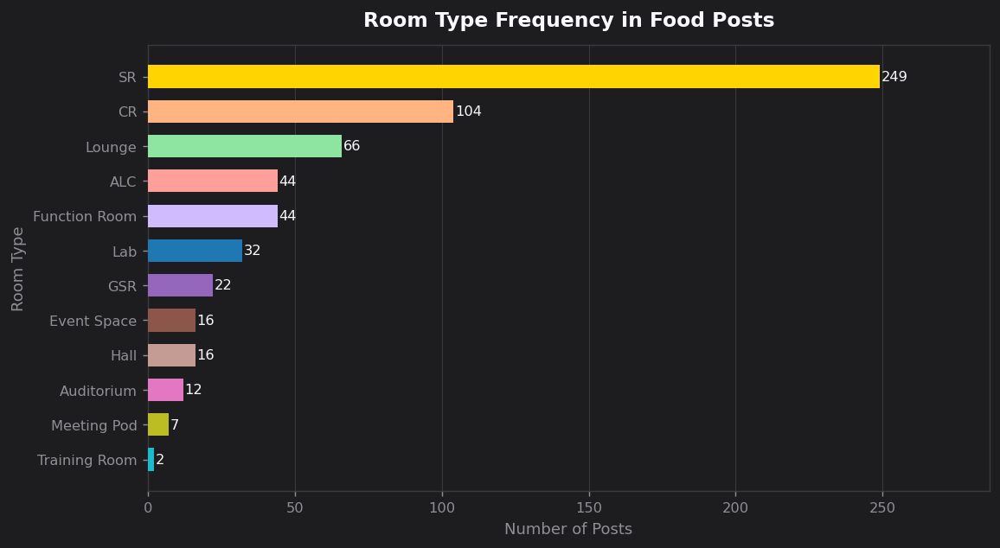

Seminar Rooms (SR, 249) appear more than twice as often as Classrooms (CR, 104) — SMU's pedagogy means SRs are the default event space. Lounges (66) rank third, reflecting the volume of casual leave-it-on-the-bench posts. Active Learning Classrooms (ALC, 44) and Function Rooms (44) tie for fourth. Group Study Rooms (GSR, 22) are surprisingly infrequent given how many there are on campus.

---

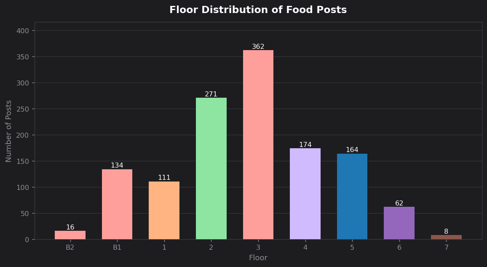

Floor 3 is the single biggest hotspot (362 posts), followed by Floor 2 (271). Floors 2–5 account for the bulk of food activity — these are the main teaching floors across most buildings. Basements are more active than expected: B1 alone records 134 posts, mainly from SOL and SCIS seminar rooms. Floor 7 is almost never mentioned (8 posts).

---

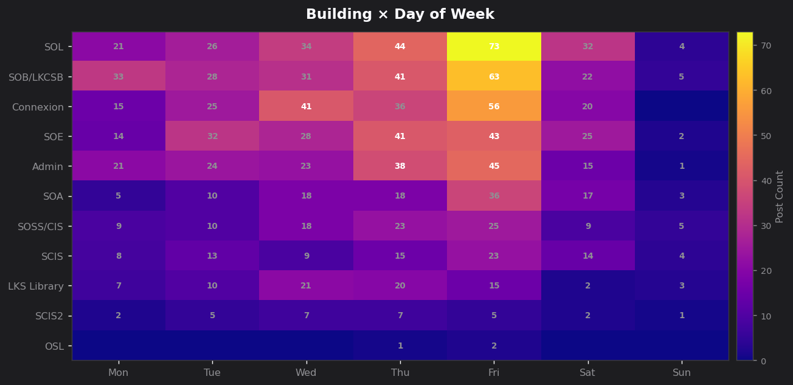

Friday is the dominant food day across every single building. SOL's Friday count (73) is nearly double any other cell in the chart. SOB/LKCSB (63 on Fri) and Connexion (56 on Fri) follow closely. Monday is notably active for SOB/LKCSB (33), suggesting business school events are often scheduled at the start of the week. Sunday is essentially silent everywhere.

---

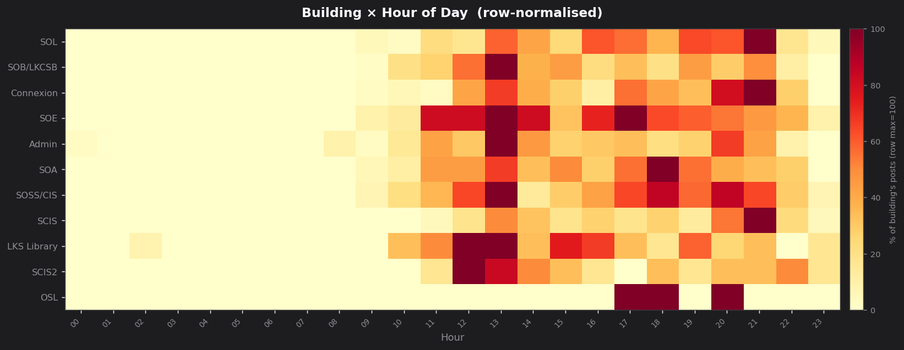

Each row is normalised to its own maximum, so small buildings still show their peak shape clearly. SOE has the sharpest lunchtime signal (11–13h), consistent with a culture of midday seminars. SOL and SOB/LKCSB both show heavy evening presence (19–21h). Connexion spreads across lunch and evening roughly equally. LKS Library has a faint signal at 3h — a handful of late-night study-session posts — but its main activity is afternoon and evening.

---

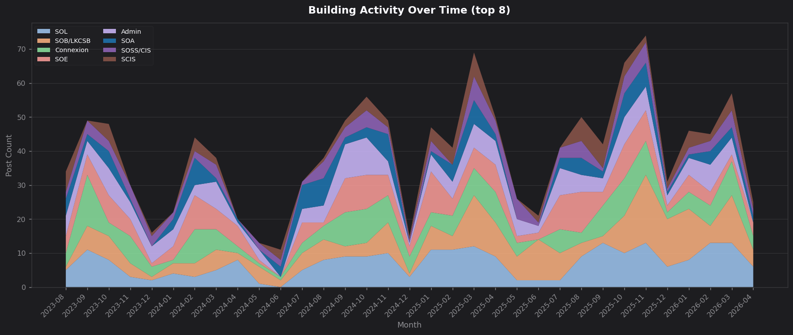

Food activity across all buildings tracks the SMU academic calendar: troughs in May–July and December, peaks in August–October and February–March. SOL and SOB/LKCSB maintain the largest consistent footprint throughout the dataset. Activity in every building compresses tightly during holiday gaps, confirming the food alerts are driven by on-campus event schedules, not random generosity.

---

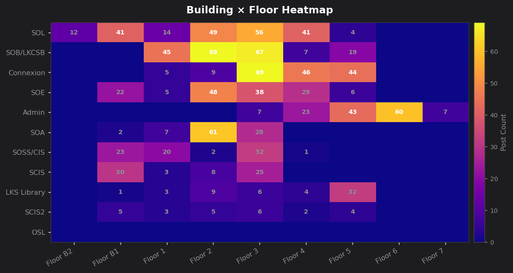

Each building has a characteristic home floor for events. SOA concentrates almost entirely on Floor 2 (61 posts). Connexion is spread across Floors 3, 4 and 5 roughly equally, reflecting its multi-floor event-space design. Admin's hotspot is Floor 6 (60) — the University Lounge — with Floor 5 second (43). SCIS posts cluster on B1 (30), pointing to its basement seminar rooms. LKS Library events predominantly occur on Floor 5 (32), the quiet zone and café level.

---

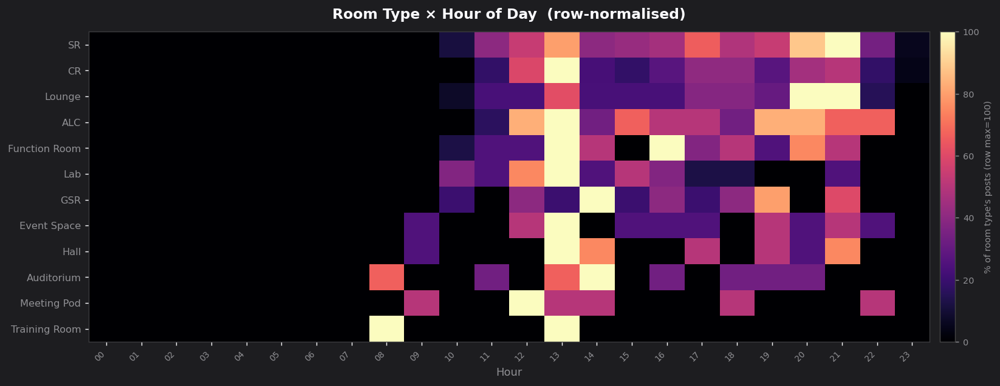

Each row is normalised to its own maximum. Seminar Rooms and Classrooms both light up from 10h onwards with a sustained evening peak at 19–21h. Lounges peak twice — at lunch (12–13h) and late at night (21–22h), which matches the "someone left food in the lounge after an event" pattern. Active Learning Classrooms have a strong midday signal and an unusual late-night tail at 23h. The Auditorium shows a distinct 8h spike — a few large morning talks. Training Rooms appear almost exclusively at 7–8h, consistent with early corporate-style sessions.

---

After you run the pipeline, `out/manifest.json` lists every PNG path under `out/` for that run, and `docs/readme/` is refreshed to match.
