# Buffet Clearers Overengineered

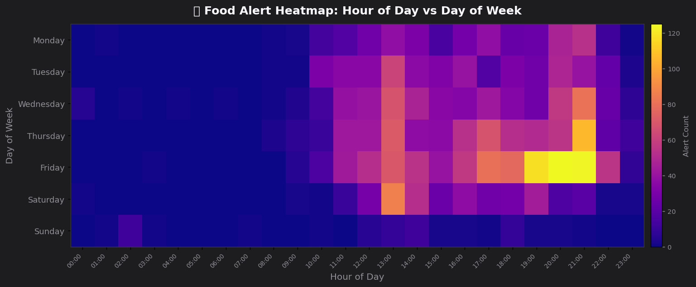

The struggle is real. So is the data.

**This repo:**  
- Reads Telegram group food raid data  
- Overanalyzes it with Python, pandas, and unnecessarily pretty graphs  
- Tries to predict when and where food will appear, for science (and snacks)  
- Renders a gallery of charts about snacks, ice cream, and desperate students  
- Useful for data nerds and hungry undergrads


## Requirements

- Python 3.10+ recommended  
- Dependencies are listed in `requirements.txt` (pandas, numpy, matplotlib, boto3, scikit-learn).

## Data

The loader picks a chat export in this order:

1. `BUFFET_CHAT_EXPORT` — path to a JSON export file, if set  
2. `data/chat_export.json` — if present  
3. `data/result.json` — if present  
4. `data/chat_export.sample.json` — bundled sample  
5. Otherwise it tries S3 via a local metadata API (see `src/load_inspect.py`).

For a normal local run, place your export as `data/result.json` or `data/chat_export.json`, or set `BUFFET_CHAT_EXPORT`.

## How to run

From the project root:

```bash
python -m pip install -r requirements.txt
python run_graphs.py
```

Or use the wrappers (install deps + run the pipeline):

- **Windows:** `render_graphs.cmd`
- **macOS / Linux:** `chmod +x render_graphs.sh && ./render_graphs.sh`

On Windows, if you see encoding issues in the console, the scripts set `PYTHONIOENCODING=utf-8`; `run_graphs.py` also reconfigures stdout/stderr to UTF-8 when possible.

Outputs are written under `out/`, grouped by category. A manifest of generated PNGs is saved as `out/manifest.json`.

## Output gallery

### Food patterns

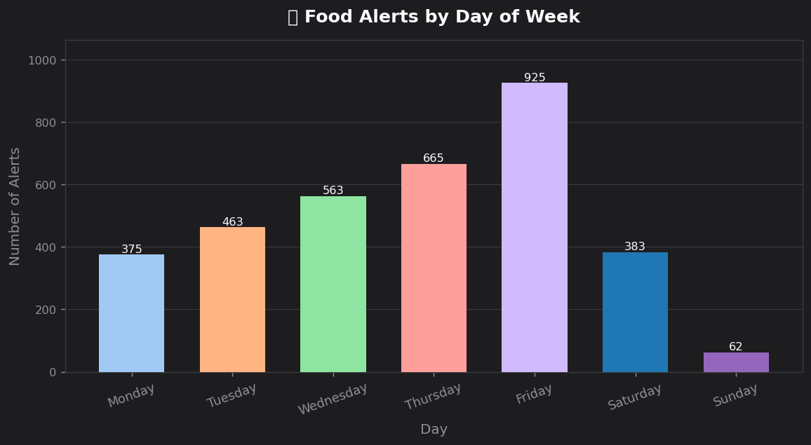

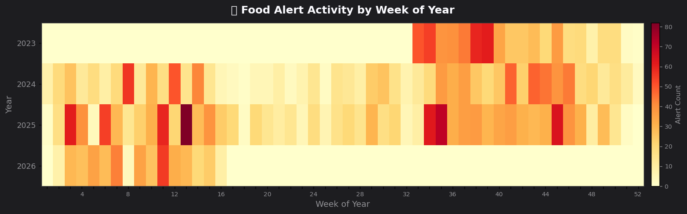


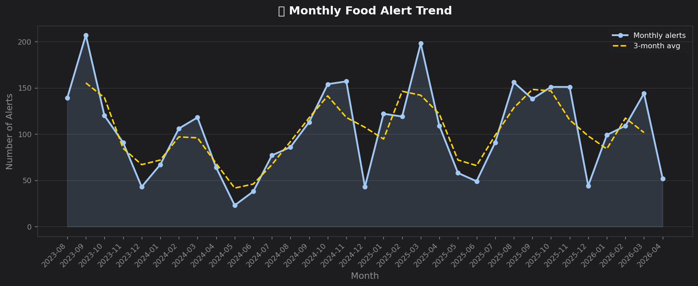

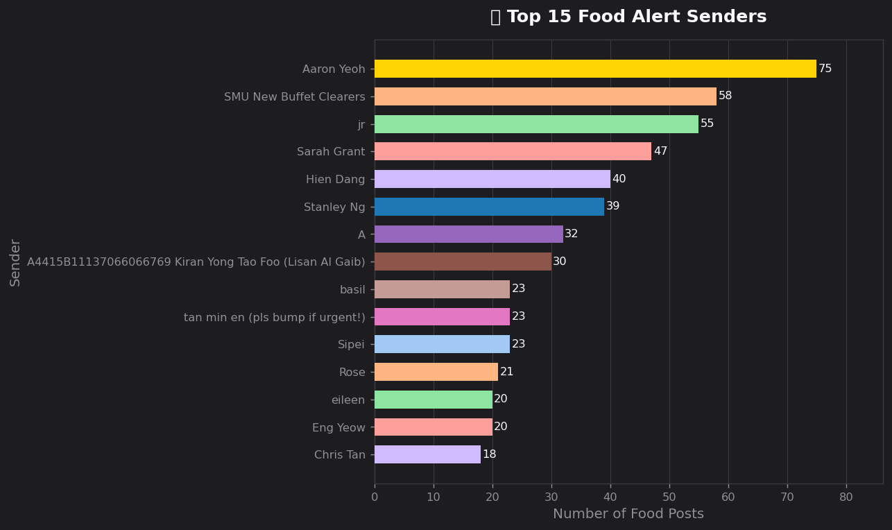

### Weekly alerts

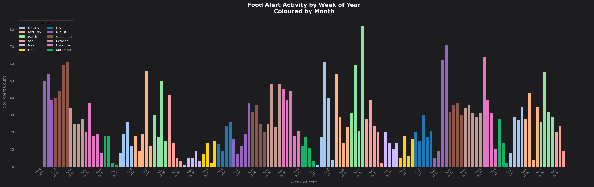

### Prediction model

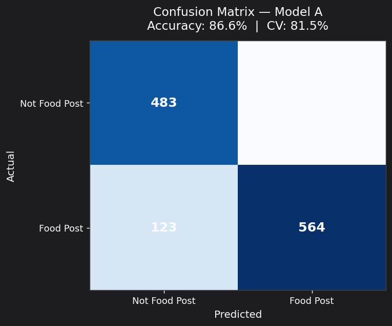

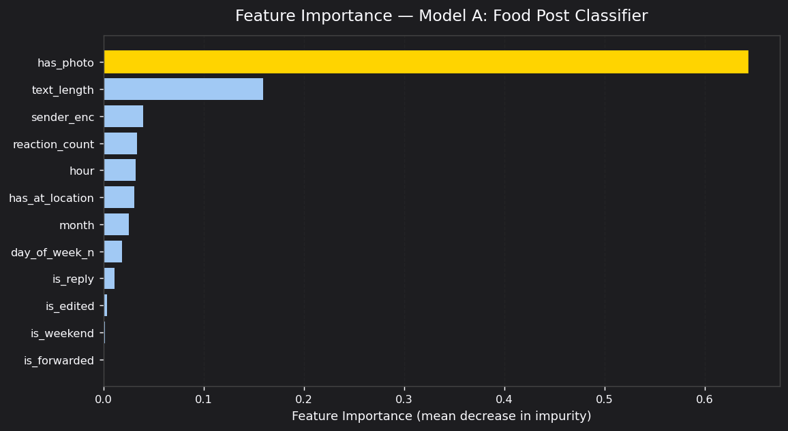

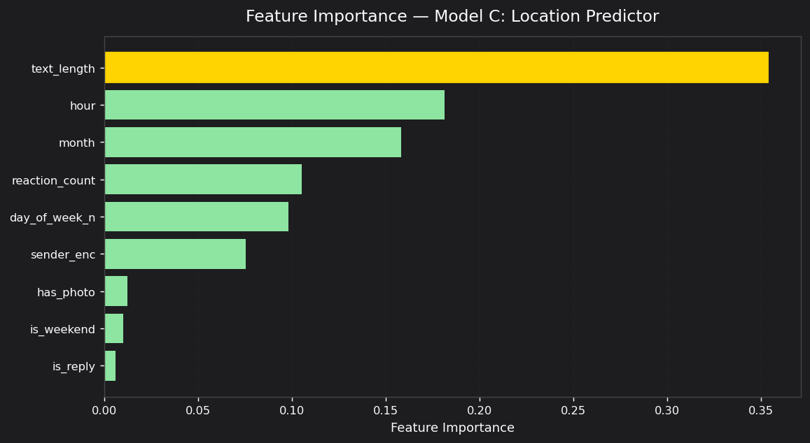

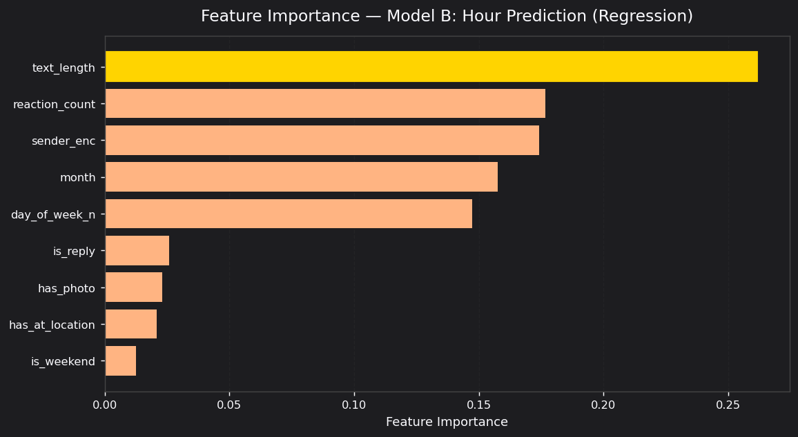

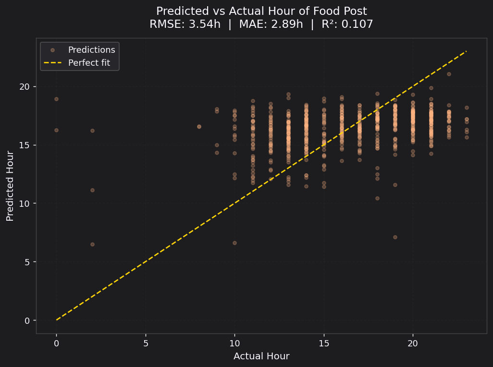

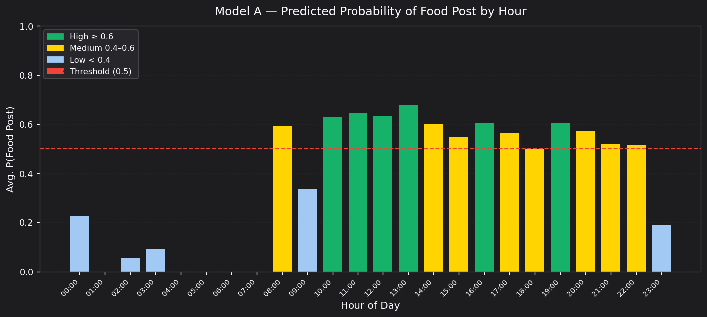

---

After you run the pipeline, `out/manifest.json` lists every PNG path under `out/` for that run, and `docs/readme/` is refreshed to match.
